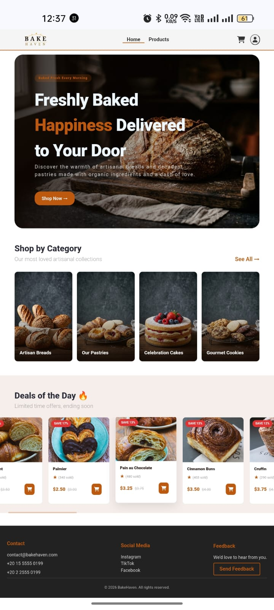

# 🥐 BakeHaven — Artisan Bakery E-Commerce

> A fully client-side, multi-page bakery storefront built with vanilla HTML, CSS, and JavaScript — no frameworks, no build tools, just clean fundamentals.



---

## 📖 Overview

BakeHaven is a static e-commerce prototype for an artisan bakery. It simulates a real shopping experience — browsing products, managing a cart, and completing checkout — entirely in the browser using `localStorage` for state and a local JSON API for product and user data.

The project was built collaboratively as part of a structured full-stack internship at **ITI (Information Technology Institute)**, with each team member owning one or more pages end-to-end.

---

## ✨ Features

### 🏠 Home Page
- **Hero banner** with a full-width bakery photo, headline, and a "Shop Now" call to action
- **Shop by Category** — four visual category cards (Artisan Breads, Pastries, Celebration Cakes, Gourmet Cookies) that filter the products page on click
- **Deals of the Day** — a horizontally scrollable carousel of up to 16 products showing live discount percentages calculated from original vs. sale price, sales count, and a quick-view button

### 🛍️ Products Page
- **Category filter** — checkboxes dynamically built from the product data; supports multi-select
- **Live search** — filters the grid as you type, matching against product names
- **Results count** — always shows how many products match the current filter state
- Responsive 4-column grid that collapses gracefully on smaller screens

### 🔍 Product Detail Page
- Large main image with a **4-thumbnail gallery** — click any thumbnail to swap the main image
- Product name, star rating, price, and a full description
- **Stock status indicator** — "In Stock", "Only N left!", or "Out of Stock" with colour-coded alerts
- Quantity selector with min/max enforcement against live stock
- **Tabbed info section:**
  - **Details** — weight and shelf life for diet-conscious shoppers
  - **Ingredients** — allergen tags (eggs, dairy, gluten, nut-free) for allergy-aware customers
  - **Shipping** — delivery time, fee, and packaging details
- Customer reviews section with a star breakdown bar chart

### 🛒 Cart Page
- Full item list with image, name, short description, quantity controls (+/−), and per-item subtotal
- Inline quantity updates and item removal without page reload
- Order summary sidebar with subtotal and total
- "Clear Cart" and "Continue Shopping" actions
- Persists across page refreshes via `localStorage`

### 💳 Checkout Page
- **Smart contact section** — shows a logged-in user's name/email card, or email + name inputs for guests
- Full shipping address form
- Credit card payment form with card number, expiry, and CVV fields
- **Charity donation selector** — optional $1 / $2 / $5 donation added to the order total
- Real-time total update as donation is selected
- 2-second processing overlay → success state → redirect to home
- Stock is decremented and cart is cleared on confirmed purchase

### 🔐 Login Page
- Email + password authentication against a local `users.json` data file
- Session saved to `localStorage` — persists across tabs and refreshes
- Header account button updates dynamically: shows user initial when logged in, a user icon when logged out
- Logout available from a header dropdown on any page

### 💬 Feedback Modal
- Available site-wide from the footer
- Name, email, and message fields with validation
- Submissions saved to `localStorage`
- Auto-closes with a success message after submission
- Dismissible via close button, backdrop click, or `Escape` key

---

## 🗂️ Project Structure

```
bakehaven/
├── index.html              # Home page
├── products.html           # Products listing with filters
├── product-detail.html     # Single product view
├── cart.html               # Shopping cart
├── checkout.html           # Checkout flow
├── login.html              # Sign in
│
├── css/
│   ├── header-footer.css   # Shared header, footer, modal styles
│   ├── home.css            # Home page styles
│   ├── product-details.css # Product detail page styles
│   ├── checkout.css        # Checkout page styles
│   └── main.css            # Login page styles
│
├── js/
│   ├── api.js              # fetchJSON() helper used across all pages
│   ├── cart.js             # Cart state, stock tracking, renderCart()
│   ├── user.js             # Session management, login/logout, validateCredentials()
│   ├── event.js            # Header dropdown, feedback modal logic
│   ├── home.js             # Deals of the Day carousel
│   ├── products-page.js    # Product grid, filters, search
│   ├── product-details.js  # Product detail rendering, tabs, add-to-cart
│   └── checkout.js         # Checkout form, donation, order completion
│
└── api/
    ├── products        # Product catalogue (id, name, price, stock, images, specs…)
    ├── users           # User accounts (id, name, email, password)
    └── images/             # Product and category images
```

---

## 🚀 Running Locally

No build step required. Just serve the files over HTTP:

```bash
# Python 3
python -m http.server 8000

# Node (npx)
npx serve .
```

Then open `http://localhost:8000` in your browser.

> ⚠️ Opening `index.html` directly via `file://` will cause the XHR requests to the `api/` folder to fail due to browser CORS restrictions. Always use a local server.

---

## 🌐 Live Demo

Deployed on GitHub Pages: **[eslam-lc.github.io/bakehaven](https://eslam-lc.github.io/bakehaven)**

---

## 🛠️ Tech Stack

| Layer | Choice |
|---|---|
| Markup | HTML5 |
| Styling | CSS3 (Flexbox, Grid, CSS Variables) |
| Logic | Vanilla JavaScript (ES5/ES6) |
| Data | JSON files served as a local API |
| State | `localStorage` |
| Icons | Font Awesome 6 |
| Fonts | Playfair Display, Cormorant Garamond, Poppins (Google Fonts) |
| Hosting | GitHub Pages |

---

## 👥 Team

| Page / Module | Owner |
|---|---|
| `cart.js`,`user.js`, `event.js` stock logic, checkout page | Eslam |
| Home page (`index.html`, `home.js`) | Sahar |
| Products page (`products.html`, `products-page.js`) | Wael |
| Product detail page | Manar |
| Login page, Cart  | Mohammed |

---

## 📝 Notes

- All cart and session data is stored in `localStorage` — clearing browser storage resets the app state
- Stock levels are tracked via purchase offsets in `localStorage`; they reset when storage is cleared
- No backend or database is used — this is a pure frontend prototype
- The checkout payment form is for UI demonstration only and does not process real transactions

---

&copy; 2026 BakeHaven. All rights reserved.
